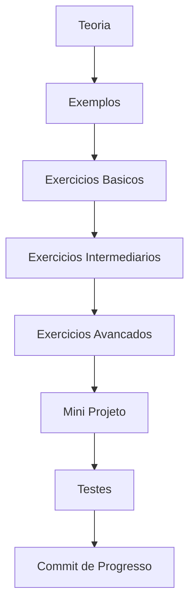

# Fluxo de Estudo

```mermaid
flowchart TD
    A[Teoria] --> B[Exemplos]
    B --> C[Exercicios Basicos]
    C --> D[Exercicios Intermediarios]
    D --> E[Exercicios Avancados]
    E --> F[Mini Projeto]
    F --> G[Testes]
    G --> H[Commit de Progresso]
```
