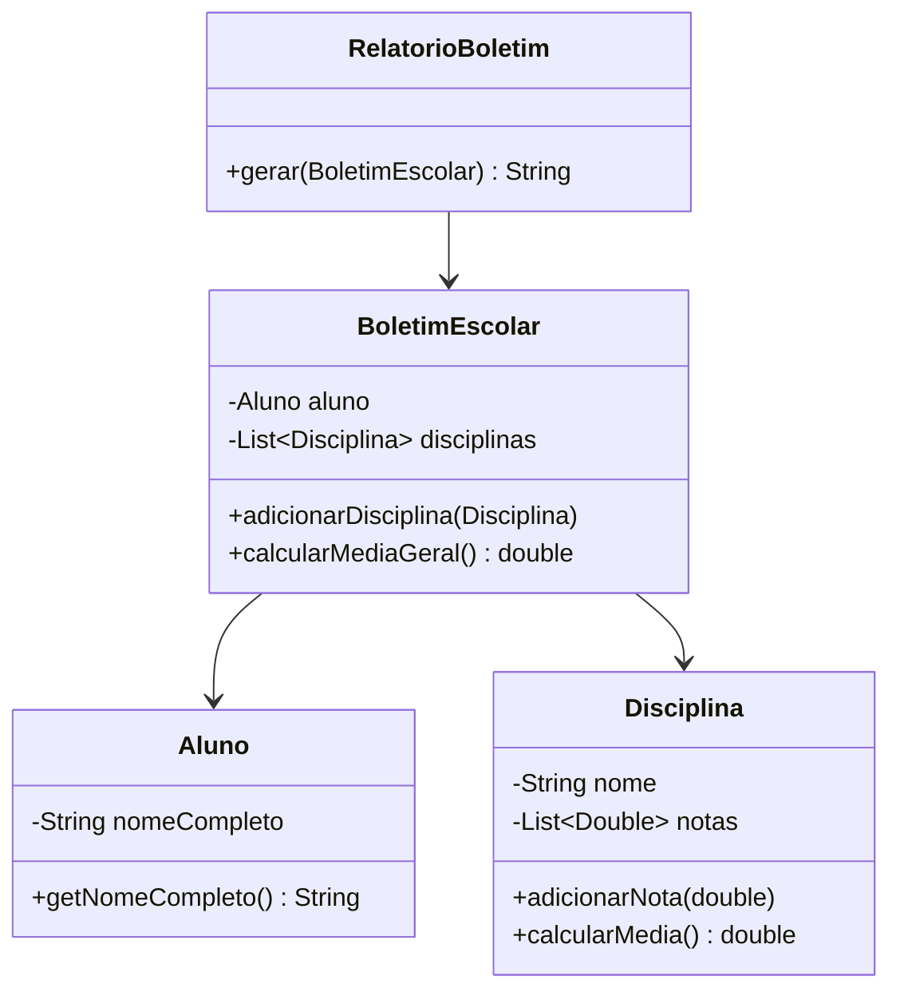

# Diagrama - Boletim Escolar

```mermaid
classDiagram
    class Aluno {
      -String nomeCompleto
      +getNomeCompleto() String
    }

    class Disciplina {
      -String nome
      -List~Double~ notas
      +adicionarNota(double)
      +calcularMedia() double
    }

    class BoletimEscolar {
      -Aluno aluno
      -List~Disciplina~ disciplinas
      +adicionarDisciplina(Disciplina)
      +calcularMediaGeral() double
    }

    class RelatorioBoletim {
      +gerar(BoletimEscolar) String
    }

    BoletimEscolar --> Aluno
    BoletimEscolar --> Disciplina
    RelatorioBoletim --> BoletimEscolar
```
