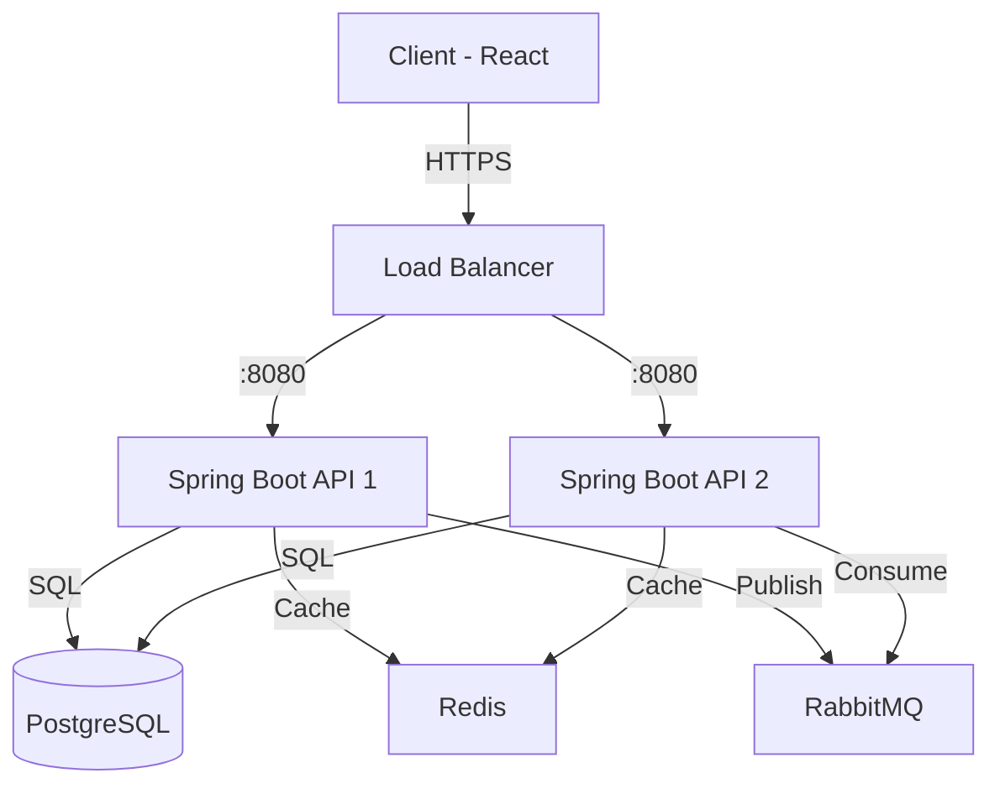

# 📐 Padrão de Arquitetura para Projetos

Cada projeto do portfólio deve seguir este padrão de documentação arquitetural.

## Estrutura de Documentação

```
projeto/
├── docs/
│   ├── architecture.md          # Visão arquitetural geral
│   ├── database.md              # Modelo de dados
│   ├── api.md                   # Documentação da API
│   ├── deployment.md            # Guia de deployment
│   ├── decisions/
│   │   ├── ADR-001-framework.md
│   │   ├── ADR-002-database.md
│   │   └── ...
│   └── diagrams/
│       ├── architecture.png
│       ├── database-model.png
│       ├── deployment.png
│       └── ...
├── README.md                    # Visão geral do projeto
├── ARCHITECTURE.md              # Alias para docs/architecture.md
└── ...
```

## 1. architecture.md

Documentar a arquitetura técnica do projeto.

```markdown
# Arquitetura - [Nome do Projeto]

## Visão Geral

[Descrição geral da arquitetura]

## Stack Tecnológico

- **Backend**: Spring Boot 3.x
- **Frontend**: React 18+
- **Database**: PostgreSQL 14+
- **Cache**: Redis
- **Message Queue**: RabbitMQ/Kafka
- **DevOps**: Docker, Kubernetes

## Componentes Principais

### 1. API Layer (REST Controllers)
```java
@RestController
@RequestMapping("/api/v1")
public class ProductController { }
```

### 2. Business Logic (Services)
```java
@Service
public class ProductService { }
```

### 3. Data Access (Repositories)
```java
public interface ProductRepository extends JpaRepository<Product, Long> { }
```

### 4. Database (Entities)
```java
@Entity
public class Product { }
```

## Padrões de Projeto

- **Repository Pattern**: Abstração de acesso a dados
- **Service Pattern**: Lógica de negócio centralizada
- **DTO Pattern**: Transferência de dados entre camadas
- **Factory Pattern**: Criação de objetos
- **Builder Pattern**: Construção de objetos complexos

## Fluxo de Requisição

```
HTTP Request
    ↓
Controller (validação, parsing)
    ↓
Service (lógica de negócio)
    ↓
Repository (acesso a dados)
    ↓
Database
    ↓
Response JSON
```

## Escalabilidade

- Load balancing com NGINX
- Cache em Redis para queries frequentes
- Replicação de database
- Horizontal scaling de APIs

## Segurança

- JWT para autenticação
- HTTPS/TLS
- CORS configurado
- SQL Injection prevention via ORM
- CSRF tokens

## Testes

- Unit tests (JUnit)
- Integration tests (TestContainers)
- Controller tests (MockMvc)
- Coverage >= 80%

## Observabilidade

- Logging estruturado (SLF4J)
- Metrics (Micrometer)
- Distributed tracing (Jaeger)
- Health checks

## Diagrama de Arquitetura

[Incluir imagem diagrama-arquitetura.png]
```

## 2. database.md

Documentar o modelo de dados.

```markdown
# Banco de Dados - [Nome do Projeto]

## Schema Overview

Entidades principais e relacionamentos.

## Entidades

### 1. Users
```sql
CREATE TABLE users (
    id SERIAL PRIMARY KEY,
    email VARCHAR(255) UNIQUE NOT NULL,
    password_hash VARCHAR(255) NOT NULL,
    first_name VARCHAR(100),
    last_name VARCHAR(100),
    role VARCHAR(50) DEFAULT 'USER',
    created_at TIMESTAMP DEFAULT CURRENT_TIMESTAMP,
    updated_at TIMESTAMP DEFAULT CURRENT_TIMESTAMP
);

CREATE INDEX idx_users_email ON users(email);
```

### 2. Products
```sql
CREATE TABLE products (
    id SERIAL PRIMARY KEY,
    name VARCHAR(255) NOT NULL,
    description TEXT,
    price DECIMAL(10, 2) NOT NULL,
    stock INT DEFAULT 0,
    category_id INT REFERENCES categories(id),
    created_at TIMESTAMP DEFAULT CURRENT_TIMESTAMP
);

CREATE INDEX idx_products_category ON products(category_id);
```

## Relacionamentos

```
User (1) ──→ (N) Order
Order (1) ──→ (N) OrderItem
Product (1) ──→ (N) OrderItem
```

## Índices

```sql
-- Performance critical
CREATE INDEX idx_orders_user_id ON orders(user_id);
CREATE INDEX idx_orders_created_at ON orders(created_at DESC);
CREATE INDEX idx_order_items_order_id ON order_items(order_id);
```

## Diagrama ER

[Incluir imagem database-model.png]
```

## 3. api.md

Documentação automática via Swagger/OpenAPI.

```markdown
# API Reference - [Nome do Projeto]

## Base URL
```
https://api.example.com/api/v1
```

## Autenticação

```
Authorization: Bearer <token>
```

## Endpoints

### Products

#### GET /products
Listar todos os produtos.

```http
GET /api/v1/products?page=0&size=20&sort=name,asc

Response 200:
{
  "content": [
    {
      "id": 1,
      "name": "Product 1",
      "price": 99.99,
      "stock": 100
    }
  ],
  "pageable": { ... },
  "totalElements": 500
}
```

#### POST /products
Criar novo produto.

```http
POST /api/v1/products
Content-Type: application/json

{
  "name": "New Product",
  "description": "Description",
  "price": 49.99,
  "stock": 100
}

Response 201:
{
  "id": 501,
  "name": "New Product",
  ...
}
```

#### GET /products/{id}
Obter um produto.

#### PUT /products/{id}
Atualizar um produto.

#### DELETE /products/{id}
Deletar um produto.

## Versioning

API versioning via URL: `/api/v1/`, `/api/v2/`

## Rate Limiting

```
X-RateLimit-Limit: 1000
X-RateLimit-Remaining: 999
X-RateLimit-Reset: 1234567890
```

## Error Handling

```json
{
  "timestamp": "2026-05-16T10:30:00Z",
  "status": 400,
  "error": "Bad Request",
  "message": "Invalid input parameters",
  "path": "/api/v1/products"
}
```
```

## 4. deployment.md

Guia de deployment.

```markdown
# Deployment - [Nome do Projeto]

## Pré-requisitos

- Docker 24+
- Docker Compose 2.0+
- Java 21 (para build local)
- PostgreSQL 14+ (desenvolvimento)

## Desenvolvimento Local

```bash
# Clonar repositório
git clone https://github.com/user/project.git
cd project

# Build com Docker Compose
docker-compose up -d

# Aplicação roda em http://localhost:8080
```

## Staging

```bash
# Build image
docker build -t myapp:latest .

# Push para registry
docker tag myapp:latest myregistry.azurecr.io/myapp:latest
docker push myregistry.azurecr.io/myapp:latest

# Deploy em staging
kubectl apply -f k8s/staging.yml
```

## Production

```bash
# Blue-Green Deployment
kubectl set image deployment/myapp \
  myapp=myregistry.azurecr.io/myapp:v1.2.3 \
  --record

# Rollback if needed
kubectl rollout undo deployment/myapp
```

## Environment Variables

```env
SPRING_DATASOURCE_URL=jdbc:postgresql://db:5432/appdb
SPRING_JPA_HIBERNATE_DDL_AUTO=validate
JWT_SECRET=your-secret-key
REDIS_HOST=redis
REDIS_PORT=6379
```

## Monitoring

- Prometheus: http://localhost:9090
- Grafana: http://localhost:3000
- Logs: ELK Stack

## CI/CD

- GitHub Actions para build/test
- Deployment automático em merge
```

## 5. decisions/ADR-*.md

Architecture Decision Records.

```markdown
# ADR-001: Framework Escolhido

## Status
Aceito

## Contexto
Precisamos de um framework web rápido e profissional.

## Decisão
Usar Spring Boot 3.x ao invés de alternatives (Quarkus, Micronaut).

## Consequências
- ✅ Ecossistema maduro e grande comunidade
- ✅ Excelente documentação
- ✅ Muitos recursos disponíveis
- ❌ Bootstrap mais lento que Quarkus
- ❌ Memória inicial maior

## Alternativas Consideradas
1. Quarkus - mais leve
2. Micronaut - startup mais rápido
3. Vert.x - reativo nativo

## Referências
- Spring Boot Docs
- Spring Data JPA
```

## 📋 Checklist de Documentação

Cada projeto deve ter:

- [ ] README.md completo
- [ ] docs/architecture.md com visão geral
- [ ] docs/database.md com schema
- [ ] docs/api.md com endpoints (ou Swagger)
- [ ] docs/deployment.md com guia
- [ ] docs/decisions/ com ARDs importantes
- [ ] docs/diagrams/ com imagens
- [ ] Diagramas: arquitetura, database, deployment, componentes
- [ ] Exemplos de curl/Postman
- [ ] Troubleshooting section
- [ ] Links para recursos externos

## 🎨 Templates de Diagramas

### Arquitetura (Mermaid/PlantUML)



### Database (ERD)

```
User ||--o{ Order : places
User ||--o{ Address : has
Order ||--o{ OrderItem : contains
Product ||--o{ OrderItem : "ordered in"
```

### Deployment (Kubernetes)

```
Ingress
  ↓
Service (LoadBalancer)
  ↓
Pod (Deployment)
  ├─ Container: API
  ├─ Container: Logger
  └─ Volume: PersistentVolumeClaim
```

## 🚀 Exemplo Prático

Para o **Projeto 1 (ERP Lite)**:

```
projects/01-erp-lite/
├── docs/
│   ├── architecture.md          # Spring Boot 3-layer, React hooks
│   ├── database.md              # 8 tabelas: users, products, sales, etc
│   ├── api.md                   # 25 endpoints REST
│   ├── deployment.md            # Docker + AWS ECS
│   ├── decisions/
│   │   ├── ADR-001-spring-boot.md
│   │   ├── ADR-002-postgresql.md
│   │   └── ADR-003-react-hooks.md
│   └── diagrams/
│       ├── architecture.png
│       ├── database-model.png
│       ├── deployment.png
│       └── component-diagram.png
├── backend/
├── frontend/
├── README.md
└── ARCHITECTURE.md              # Link para docs/architecture.md
```

## 📚 Leitura Recomendada

- [Arc42 Documentation](https://arc42.org/)
- [Architecture Decision Records](https://adr.github.io/)
- [12 Factor App](https://12factor.net/)
- [Microservices Patterns](https://microservices.io/patterns/)

---

**Aplicar este padrão em TODOS os 10 projetos = Diferencial gigante!**

